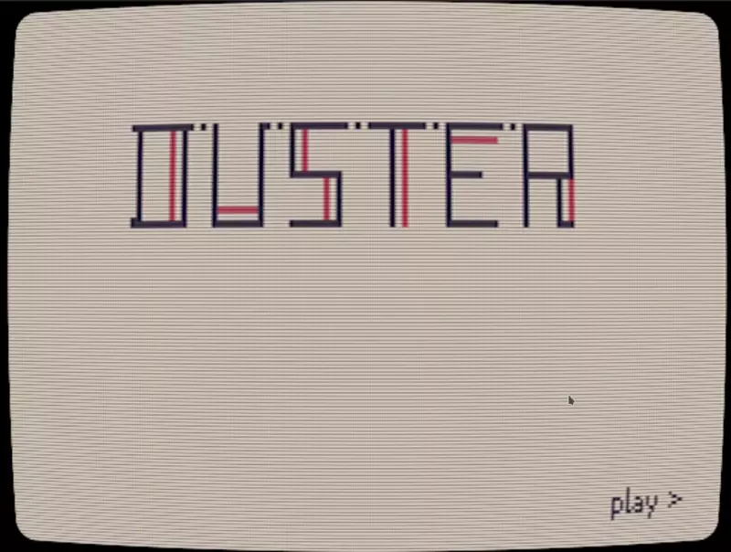

# duster

a sleek strategy game for the gba



## build

### deps

+ git
+ devkitarm (packages: `tonc`, `grit`)
+ [crunch](https://github.com/redthing1/crunch)

### from source

go to `src/DusterGBA`
```sh
git submodule update --init --recursive
make build DEBUG=1
```

this will output `Duster.gba`